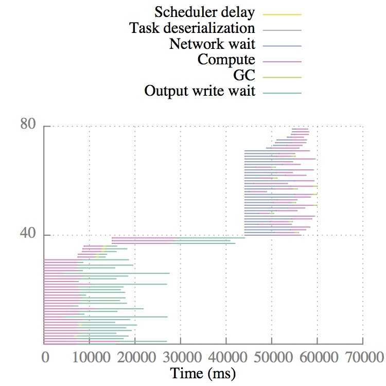

# Understanding Spark Performance

This repository contains scripts to understand the performance of jobs run with [Apache Spark](https://spark.apache.org/).

## Configuring Spark to log performance data

In order to use these tools, you'll first need to configure Spark to log performance data while jobs are running
by setting the Spark configuration parameter `spark.eventLog.enabled` to `true`.  This configuration parameter
causes the Spark master to write a log with information about each completed task to a file on the master. The master
already tracks this information (much of it is displayed in Spark's web UI); setting this configuration option
just causes the master to output all of the data for later consumption.  By default, the event log is written to
the file `/tmp/spark-events` on the machine where the Spark master runs, but you can change the paramter
`spark.eventLog.dir` to write the event log elsewhere (e.g., to HDFS).  See the
[Spark configuration documentation](http://spark.apache.org/docs/1.2.1/configuration.html) for more information.

These scripts are written to work with data output by Spark version 1.2.1 or later.

## Analyzing performance data

After you have collected a `spark-events` file with JSON data about the job(s) you'd like to understand, run
the `parse_logs.py` script to generate a visualization of the jobs' performance:

    python parse_logs.py spark-events

For each job in the `spark-events` file, the Python script will output a gnuplot file that, when plotted, will
generate a waterfall depicting how time was spent by each of the tasks in the job.  The plot files are named
`spark-events_[JOB_ID]_waterfall.gp`. To plot the waterfall for job 0, for example:

    gnuplot spark-events_0_waterfall.gp

will create a file `spark-events_0_waterfall.pdf.  The waterfall plots each task as a horizontal line.  The
horizontal line is colored by how tasks spend time. Tics on the y-axis delineate different stages of tasks.

Here's an example waterfall:

This waterfall shows the runtime of a job that has 4 stages. The first stage has 2037 tasks, the second
stage has 100 tasks, and the final two stages each have 200 tasks. One thing that stands out for
this job is that tasks in the second stage are spending a long time writing output data to disk
(shown in teal). In this case, this is because the job was running on top of the ext3 file system,
which performs poorly when writing many small files; once we upgraded to a different file system,
the job completed much more quickly and most of the teal-colored time spent writing shuffle output
data disappeared.
